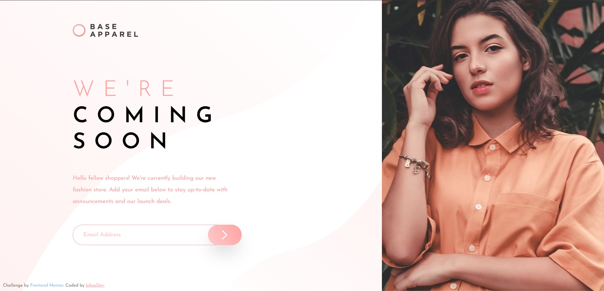

# Frontend Mentor - Base Apparel Coming Soon Page Solution

This is my solution to the [Base Apparel Coming Soon Page challenge](https://www.frontendmentor.io/challenges/base-apparel-coming-soon-page-5d46b47f8db8a7063f9331a0) on Frontend Mentor. The goal of this project was to build a responsive landing page with email validation while matching the provided design as closely as possible.

## Overview

### The challenge

Users should be able to:

- View the optimal layout for different screen sizes.
- See hover and active states for interactive elements.
- Receive an error message when:
  - The email field is empty.
  - The email format is invalid.
- Successfully submit the form with a valid email address.

### Screenshot



### Links

- Solution URL: https://www.frontendmentor.io/solutions/base-apparel-coming-soon-master-61-jkhwBPc
- Live Site URL: https://base-apparel-coming-soon-master.bikazdev.workers.dev/

---

## My Process

### Built with

- React
- Vite
- Tailwind CSS
- Motion (Framer Motion)
- JavaScript (ES6+)
- Semantic HTML5
- Mobile-first workflow

### What I learned

During this project, I practiced several important frontend concepts:

- Real-time email validation using Regular Expressions.
- Managing form state with React's `useState`.
- Conditional rendering for displaying validation errors.
- Creating smooth UI animations with Motion.
- Building responsive layouts using Tailwind CSS.
- Improving user experience with immediate validation feedback.

Example of the email validation logic:

```js
const EMAIL_REGEX = /^[a-zA-Z0-9._%+-]+@[a-zA-Z0-9.-]+\.[a-zA-Z]{2,}$/;

if (!EMAIL_REGEX.test(value)) {
  setError("Please provide a valid email");
} else {
  setError("");
}
```

### Continued development

For future projects, I'd like to continue improving my skills in:

- Accessible form validation.
- Advanced form handling with React Hook Form.
- Writing cleaner and more reusable React components.
- Creating more polished UI animations.

### AI Collaboration

AI tools used during development:

- **ChatGPT**

How I used AI:

- Reviewing React best practices.
- Improving email validation logic.
- Debugging component behavior.
- Discussing responsive layout decisions.
- Refining animation implementation with Motion.

AI helped speed up problem-solving and provided alternative implementation approaches, while the final architecture and implementation decisions were made manually.

---

## Author

- GitHub - https://github.com/bikazdev
- Frontend Mentor - https://www.frontendmentor.io/profile/bikazdev

---

## Acknowledgments

Thanks to Frontend Mentor for providing realistic frontend challenges that help developers improve their practical skills.
